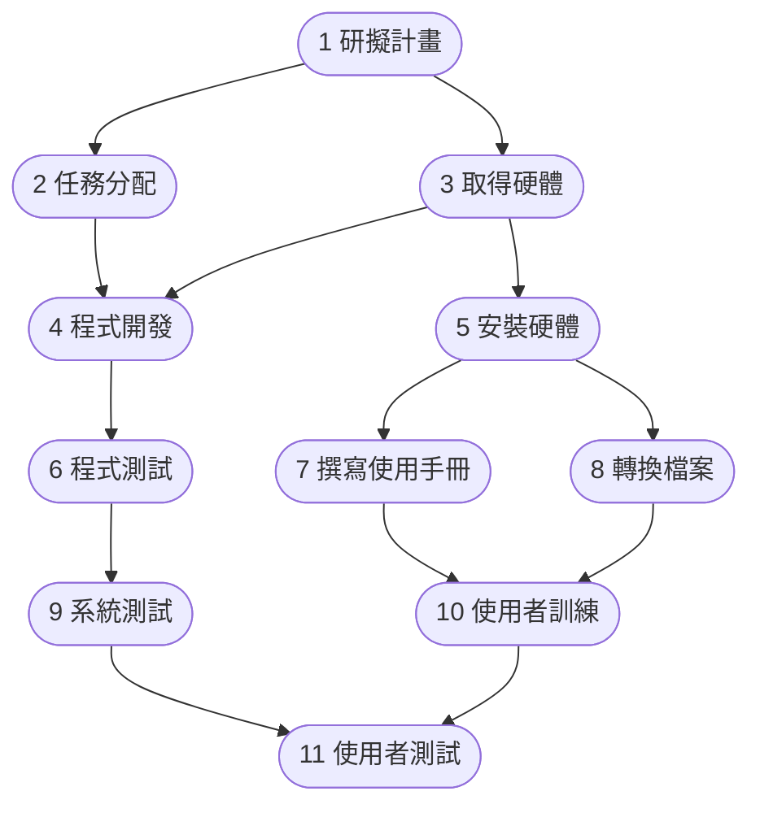
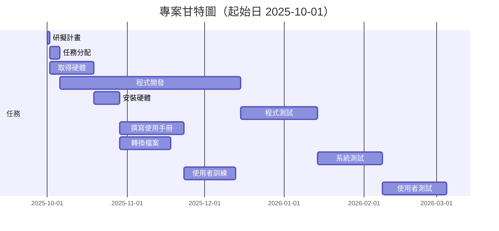

# hw2 — PERT/CPM 與甘特圖
## 📘 任務資料表

| 任務 | 說明 | 需時(天) | 前置任務 | 開始時間 | 結束時間 |
|------|------|-----------|-----------|-----------|-----------|
| 1 | 研擬計畫 | 1 | - | 第 0 天 | 第 1 天 |
| 2 | 任務分配 | 4 | 1 | 第 1 天 | 第 5 天 |
| 3 | 取得硬體 | 17 | 1 | 第 1 天 | 第 18 天 |
| 4 | 程式開發 | 70 | 2, 3 | 第 18 天 | 第 88 天 |
| 5 | 安裝硬體 | 10 | 3 | 第 18 天 | 第 28 天 |
| 6 | 程式測試 | 30 | 4 | 第 88 天 | 第 118 天 |
| 7 | 撰寫使用手冊 | 25 | 5 | 第 28 天 | 第 53 天 |
| 8 | 轉換檔案 | 20 | 5 | 第 28 天 | 第 48 天 |
| 9 | 系統測試 | 25 | 6 | 第 118 天 | 第 143 天 |
| 10 | 使用者訓練 | 20 | 7, 8 | 第 53 天 | 第 73 天 |
| 11 | 使用者測試 | 25 | 9, 10 | 第 143 天 | 第 168 天 |

## PERT / CPM 網路圖

## 甘特圖

## 關鍵路徑

**如果以 2025-10-01 為起始日，專案預計將在約 168 個工作日後（約 2026 年 3 月中旬）完成。**

**關鍵路徑：A1→A3→A4→A6→A9→A11**

